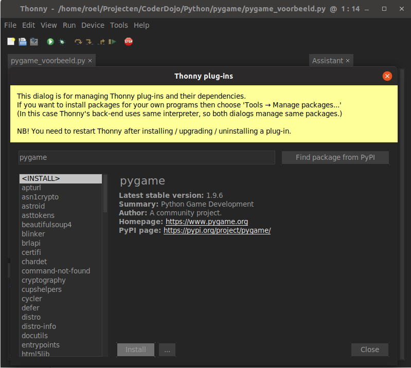
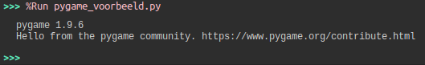
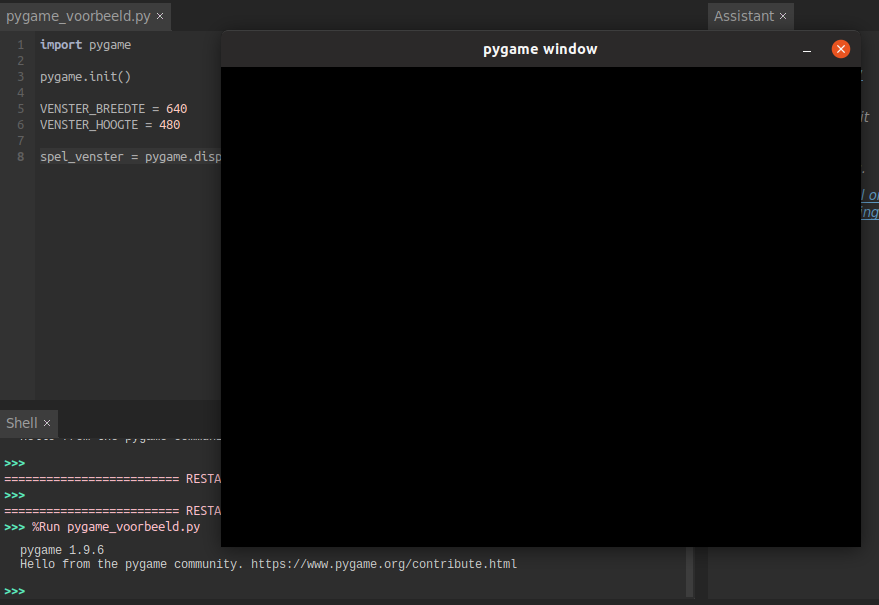

# Gamedevelopment met Python en PyGame

## 0. Introductie

### Wat gaan we maken?

Een eenvoudig spelletje waarbij je een blokje bestuurt en andere blokken moet ontwijken.

### Wat gaan we leren?

 - Python natuurlijk!
 - We maken gebruik van de pygame bibliotheek
 - Werken met classes en functies
 - Object-georiënteerd programmeren

### Hoe gaan we te werk?

We gaan even nadenken over wat we willen maken, dat splitsen we dan in verschillende kleine taken die we makkelijk één voor één kunnen oplossen. 

We starten altijd met zo min mogelijk code om iets werkende krijgen en daar bouwen we telkens op verder.

Tussen de verschillende stappen door herschrijven we onze code, "*refactoren*" in het jargon, om ze proper en leesbaar te houden. Niet alleen de computer moet onze code kunnen lezen, ook onze vrienden en je toekomstige zelf ;)

### Vereisten

Je moet de pygame-bibliotheek installeren, als je [Thonny](https://thonny.org/) gebruikt kan je dat via *Tools* - *Manage Plug-ins...*, daar zoeken naar *pygame* en op *Install* klikken. Als je Idle of Visual Studio Code, of nog iets anders, gebruikt dan typ je in de console `pip install pygame`.



Test of het gelukt is door een script met enkel deze regel uit te voeren:

```python
import pygame
```

Als alles in orde is zie je in je console deze melding:



Nu kunnen we er invliegen!

## 1. Veel kleintjes maken een groot

Eerst gaan we ons "probleem" opsplitsen in kleine stapjes. We willen en spel maken en dat is wat veel om zomaar ineens te doen. Daarom splitsen we het op in zo klein mogelijk stapjes. Elk stapje moet iets opleveren dat werkt en waarop we kunnen verder bouwen. Bijvoorbeeld:

    1. Een PyGame venster tonen
    2. Iets tekenen in het venster
    3. Iets laten bewegen in het venster
    4. Meerdere dingen tekenen en laten bewegen
    5. Iets laten bewegen met toetsenbordcommando's
    6. ...

Als we op dit punt gekomen zijn verzinnen we dan wel weer iets, de bedoeling nu is kunnen starten en iets hebben om naar toe te werken.

## 2. Een PyGame venster tonen

Wat is het kleinste dat we kunnen maken dat werkt? Een leeg venster! Niet zo erg spannend maar dat is wel de basis waarop we gaan bouwen. 

We hebben PyGame al geïmporteerd:

```python
import pygame
```

Voor we met de functies van PyGame kunnen werken moeten we PyGame initialiseren. Voorlopig gaan we hier niet dieper op in maar deze stap is belangrijk. Niet vergeten dus!

```python
import pygame

pygame.init()
```

Nu kunnen we een venster maken, we moeten zeggen hoe groot we het willen. De afmetingen zijn in pixels.

```python
import pygame

pygame.init()

spel_venster = pygame.display.set_mode((640, 480))
```

Dit zal wel werken maar iemand die onze code ziet zal zich terecht afvragen wat 640 en 480 zijn. Om de code leesbaarder te maken gaan we variabelen maken met een duidelijk naam en die gebruiken. Dit is beter:

```python
import pygame

pygame.init()

VENSTER_BREEDTE = 640
VENSTER_HOOGTE = 480

spel_venster = pygame.display.set_mode((VENSTER_BREEDTE, VENSTER_HOOGTE))
```

Het resultaat is niet echt spannend:



Maar ik heb geen errors dus alles gaat goed! 

Het venster sluiten gaat niet zoals je merkt, gebruik de rode stopknop van Thonny. Dat moeten we nog fiksen. Met een extra statement `pygame.quit()` sluiten we het PyGame-venster.

Als je het programma uitvoert merk je dat er even een zwart venster getoont wordt dat dan meteen afsluit. We moeten dus alles wat willen doen uitvoeren na het initialiseren, dat is al het voorbereidende werk zoals nuttige variabelen definiëren, en het `pygame.quit()` statement, dat heel de boel afsluit.

```python
import pygame

pygame.init()

VENSTER_BREEDTE = 640
VENSTER_HOOGTE = 480

spel_venster = pygame.display.set_mode((VENSTER_BREEDTE, VENSTER_HOOGTE))

# Hier dingen doen!

pygame.quit()
```

## De game-loop

De game loop is een simpele herhaling die al onze logica voor het spel bevat. Deze gaat steeds opnieuw uitgevoerd worden om meerdere keren per seconde onze game te verversen, net zoals een film bestaat uit meerdere beelden per seconde. Om deze te bouwen hebben we eerst nog wat andere zaken nodig:

 - een klok, elke tik van de klok verversen we het scherm
 - de spelstatus, om te weten of we nog aan het spelen zijn
 - events, gebeurtenissen die acties in gang zetten
 - een game-loop, die al het bovenstaande bevat en elke kloktik uitgevoerd wordt.

### De klok