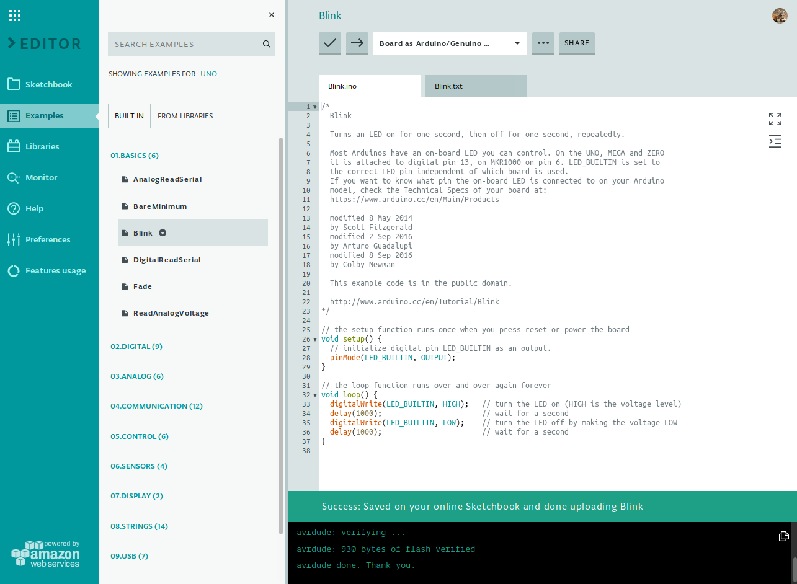
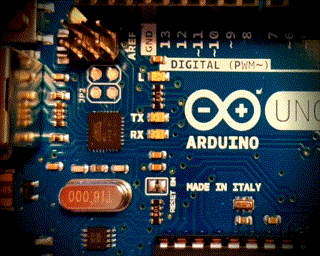
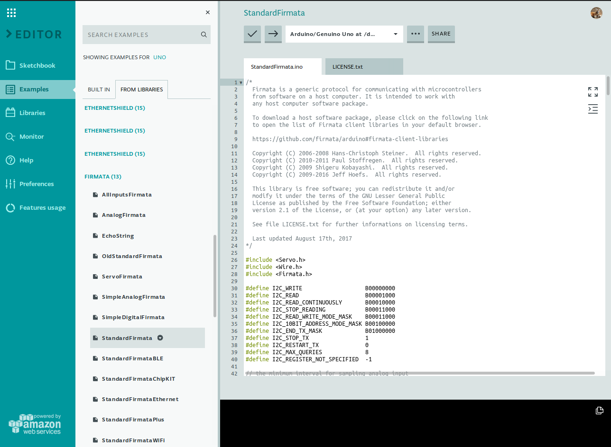
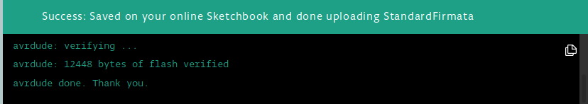

# Arduino en Python
Het is mogelijk om een Arduino aan te sturen en uit te lezen met Python. Hiervoor moeten beiden wel dezelfde "taal" spreken, tussen twee computers noemen we dat een *protocol*. 

>*Let op!* De manier die we hier beschrijven zorgt er voor dat je programma draait op je pc, en dus niet op de Arduino. Dit betekent dat je de Arduino niet op zichzelf kan gebruiken maar dat deze steeds verbonden moet blijven via de usb-kabel.

## Firmata
[Firmata](https://github.com/firmata/protocol) is een *protocol* om een computer (of tablet, gsm, ...) te laten communiceren met een *microcontroller*, zoals een [**Arduino**](https://nl.wikipedia.org/wiki/Arduino_(computerplatform)). Wat gaan we doen?

1. Op de Arduino laden we de Firmata firmware, dit is een *besturingssysteem* voor de Arduino. Als dit gebeurt is "spreekt" de Arduino de Firmata-taal.

2. Op onze computer schrijven we code die firmata spreekt met de Arduino. Hiervoor gebruiken we een *bibliotheek*, "library" in het Engels, zodat we niet alle details van deze taal zelf moeten programmeren. In principe kan je elke programmeertaal gebruiken die een library heeft voor Firmata, in deze oefening gaan we Python gebruiken.

## Wat hebben we nodig?

- Hardware
    - Een laptop of Raspberry Pi
    - Een Arduino, verbonden met de laptop of Pi via usb
    - Breadbord
    - Jumperkabels
    - Wat LED-jes en weerstanden

- Software
    - De Arduino IDE, als app of [online](https://create.arduino.cc/editor)
    - Python geïnstalleerd op laptop of Pi
    - Een IDE voor Python, zoals Idle, Thonny of VSCode

Als je dat allemaal hebt kunnen we starten.

## Verbind de Arduino met de pc

Gebruik een usb-kabel om je Arduino met je pc te verbinden, test of alles werkt door de *blink*-sketch te uploaden. 

Als het ledje op de Arduino knippert is alles in orde, als je foutmeldingen krijgt moet je dubbelchecken of je de juiste poort gekozen hebt en het correcte type Arduino aangeduid hebt. Hier is online veel van te vinden, gebruik je [Google-skills](https://www.google.com/search?q=starten+met+arduino&oq=starten+met+arduino).

## Upload de Firmata-sketch

In de Arduino IDE ga naar "Examples" - "From Libraries", klik op "Firmata" en kies "Standard Firmata".

Upload de Firmata-sketch naar de Arduino.

