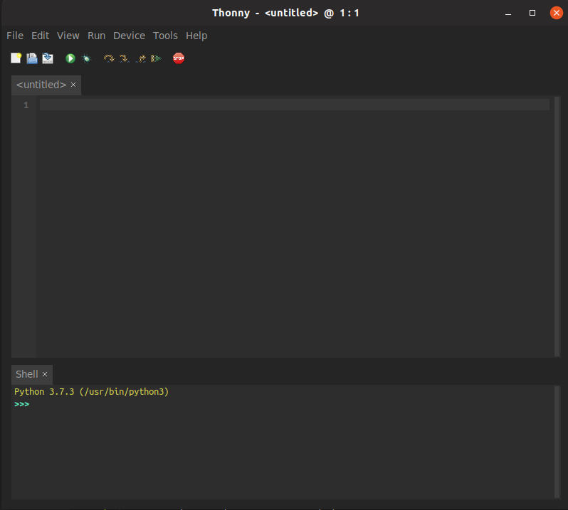
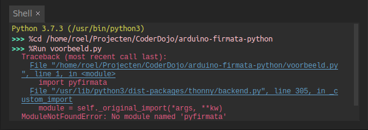
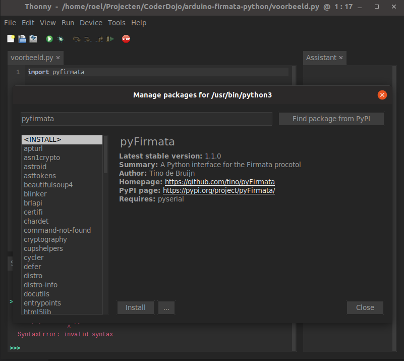
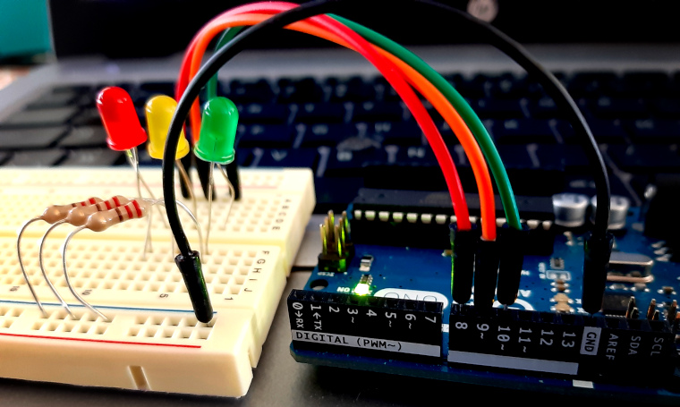
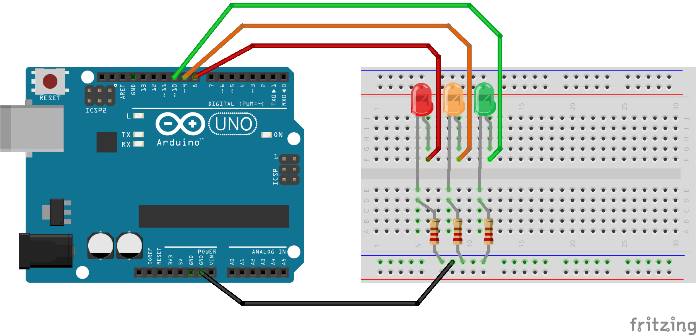
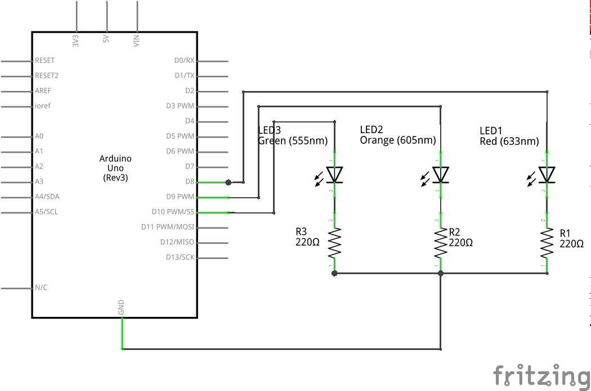

# Arduino en Python
Het is mogelijk om een Arduino aan te sturen en uit te lezen met Python. Hiervoor moeten beiden wel dezelfde "taal" spreken, tussen twee computers noemen we dat een *protocol*. 

>*Let op!* De manier die we hier beschrijven zorgt er voor dat je programma draait op je pc, en dus niet op de Arduino. Dit betekent dat je de Arduino niet op zichzelf kan gebruiken maar dat deze steeds verbonden moet blijven via de usb-kabel.

## Firmata
[Firmata](https://github.com/firmata/protocol) is een *protocol* om een computer (of tablet, gsm, ...) te laten communiceren met een *microcontroller*, zoals een [**Arduino**](https://nl.wikipedia.org/wiki/Arduino_(computerplatform)). Wat gaan we doen?

1. Op de Arduino laden we de Firmata firmware, dit is een *besturingssysteem* voor de Arduino. Als dit gebeurt is "spreekt" de Arduino de Firmata-taal.

2. Op onze computer schrijven we code die firmata spreekt met de Arduino. Hiervoor gebruiken we een *bibliotheek*, "library" in het Engels, zodat we niet alle details van deze taal zelf moeten programmeren. In principe kan je elke programmeertaal gebruiken die een library heeft voor Firmata, in deze oefening gaan we Python gebruiken.

## Wat hebben we nodig?

- Hardware
    - Een laptop of Raspberry Pi
    - Een Arduino, verbonden met de laptop of Pi via usb
    - Breadbord
    - Jumperkabels
    - Wat LED-jes en weerstanden

- Software
    - De Arduino IDE, als app of [online](https://create.arduino.cc/editor)
    - Python geïnstalleerd op laptop of Pi
    - Een IDE voor Python, zoals Idle, Thonny of VSCode

Als je dat allemaal hebt kunnen we starten.

## Verbind de Arduino met de pc

Gebruik een usb-kabel om je Arduino met je pc te verbinden, test of alles werkt door de *blink*-sketch te uploaden. 


Als het ledje op de Arduino knippert is alles in orde, als je foutmeldingen krijgt moet je dubbelchecken of je de juiste poort gekozen hebt en het correcte type Arduino aangeduid hebt. Hier is online veel van te vinden, gebruik je [Google-skills](https://www.google.com/search?q=starten+met+arduino&oq=starten+met+arduino).


## Upload de Firmata-sketch

In de Arduino IDE ga naar "Examples" - "From Libraries", klik op "Firmata" en kies "Standard Firmata".


Upload de Firmata-sketch naar de Arduino.


Nu is onze Arduino helemaal klaar om te praten met ons. We moeten natuurlijk wel nog een programma schrijven dat praat met de Arduino!

## Python script

### IDE

De IDE, of Integrated Development Environment, is een programma dat ons helpt met onze code. Je kan natuurlijk alles gewoon in een teksteditor typen maar IDE's maken ons het leven makkelijker door extra functies aan te bieden die een programmeur helpen sneller en aangenamer te werken. Ieder mag vrij zijn IDE kiezen, hier ga ik eens [Thonny](https://thonny.org/) gebruiken maar probeer gerust eens [Visual Studio Code](https://code.visualstudio.com/), Idle, [PyCharm](https://www.jetbrains.com/pycharm/), ....



### Code

Eerst importeren we een bibliotheek die ons Firmata laat praten, in dit geval *pyfirmata*.

```python
import pyfirmata
```

Als je dit uitvoert krijg je waarschijnlijk een foutmelding:



> ModuleNotFoundError: No module named 'pyfirmata'

De bibliotheek is nog niet geïnstalleerd op ons systeem! Gelukkig is het makkelijk dit te doen, typ in de console `pip install pyfirmata`, in Thonny ga je naar "Tools" - "Manage Packages", zoek naar *pyfirmata* en klik *Install*.



Nu zijn we helemaal klaar met alles voorbereiden en kunnen we er echt invliegen.

## Nu echt code

Importeer de bibliotheek:

```python
import pyfirmata
```

Initialiseer een Arduino-object:

```python
arduino = pyfirmata.Arduino('/dev/ttyACM0')
```

> Let op: op mijn (Linux)-machine zit het bordje op poort `/dev/ttyACM0`, zit je op Windows dan is het waarschijnlijk iets als `COM3`, pas dit aan in de code!

Laat het ledje op het bord branden door de pin "hoog" te maken.

```python
arduino.digital[13].write(1)
```

Op de Arduino zit één ledje op het bord dat aangesloten is op poort 13, vandaar de `digital[13]` in de code. Straks gaan we meer ledjes aansluiten en meer poorten gebruiken. Met de functie `.write()` schrijven we een waarde naar de uitgang, hier is dat een **1** wat wil zeggen dat we spanning gaan geven op poort 13.

Het volledige script ziet er nu zo uit:

```python
import pyfirmata

arduino = pyfirmata.Arduino('/dev/ttyACM0')

arduino.digital[13].write(1)
```

Als je dit uitvoert en je hebt alles correct gedaan dan gaat op het bordje het ledje aan. Het kan even flikkeren tijdens de communicatie, dit is normaal. 

Probeer het nu eens terug uit te doen.

### 3 ledjes

Laten we eens wat componenten aansluiten. Ik heb 3 ledjes genomen en met wat fantasie kan je er een verkeerslicht in zien.



Sluit de componenten aan als volgt:



Let op de polariteit van de ledjes, het korte pootje (*kathode*) moet aan de **GND** (ground, aarde of massa) komen, de weerstanden zijn 220 Ohm.



### Verkeerslicht code

Probeer, voor je naar [een mogelijke oplossing](verkeerslicht.py) gaat kijken, eens of je code kan schrijven om de ledjes aan te sturen zodat ze zich gedragen als een verkeerslicht.

Vergeet niet van `pyfirmata` te importeren en `time` ga je ook nodig hebben, zodat je `time.sleep()` kan gebruiken. Als je 1 seconde niets wil doen gebruik je `time.sleep(1)`.

Doe de ledjes aan en uit met `arduino.digital[<POORTNUMMER>].write(<1|0>)`.

Veel succes!

